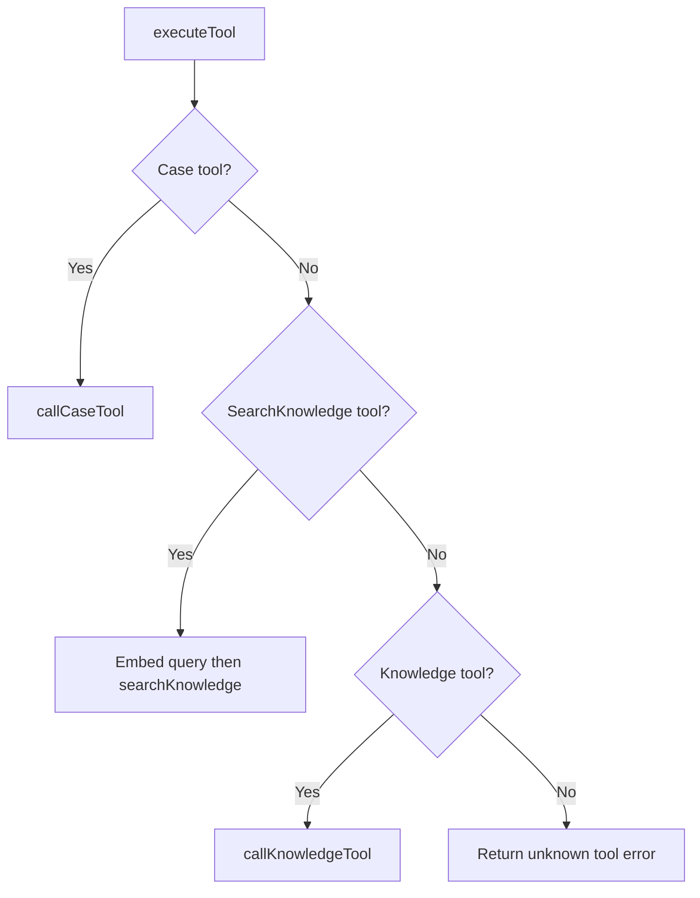
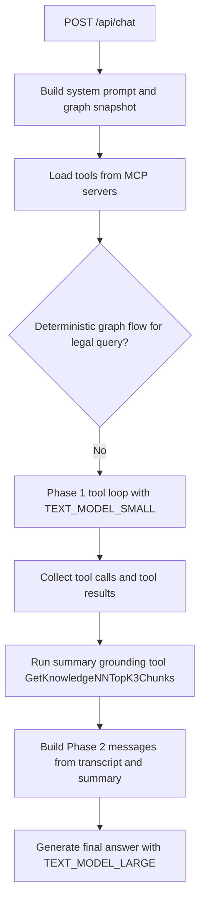
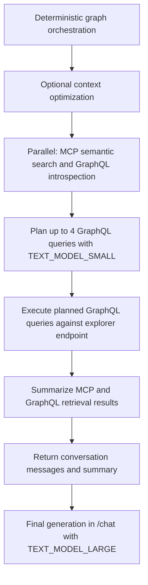

# Explorer Knowledge Flow — MCP-Based Control Flow

This document reflects the current architecture after moving explorer-style tools into MCP servers.  
There is no local `executeExplorerTool` path in `chat.router.ts`; tool discovery and execution are dynamic.

## 1. Tool Registry and Routing

`/chat` builds its tool list at runtime:

- `caseTools = await getCaseTools()`
- `knowledgeTools = await getKnowledgeTools()`
- `tools = [...caseTools, ...knowledgeTools]`

Routing in `executeTool(name, args)` is now:



Notes:

- `SearchKnowledge` is handled specially for embedding generation and dimension checks.
- `search_nodes`, `get_node`, `get_neighbors`, etc. are MCP knowledge tools.
- `parseSearchNodesTotal` is still used for telemetry + fallback logic (`search_nodes` empty-result detection).

## 2. `/chat` Standard Two-Phase Path



Key differences vs old docs:

- Tool descriptions and labels are generated from runtime tool metadata, not hardcoded lists.
- Tool set size is dynamic (depends on what MCP servers expose).
- Phase 2 uses the full tool transcript plus summary context.

## 3. Deterministic Graph Flow Branch

When `CHAT_DETERMINISTIC_GRAPH` is enabled and the query is likely legal, `/chat` delegates to
`runDeterministicGraphOrchestration(...)`.



## 4. Logging Update: Raw MCP JSON

`chat/chat-graphql-orchestrator.ts` now logs full raw semantic-search output:

```text
[chat][graph-flow] MCP semantic search done answers=5 context=15 raw={...full JSON...}
```

This is emitted in the deterministic graph-flow path right after `searchKnowledge(...)` returns.

## 5. Deprecated Paths Removed

The following are obsolete in chat routing and should not be reintroduced:

- Local explorer dispatcher (`executeExplorerTool`)
- Explorer tool type guard in router (`isExplorerToolName`)
- Hardcoded static tool-semantic lists for explorer tools
