# Explorer Tools Integration — Control Flow

This document illustrates how the Virginia law knowledge graph explorer tools flow through the system, from Electron process startup through chat and research agent tool dispatch, using concrete example scenarios.

---

## 1. Process Startup

When the Electron app launches, it starts three processes: the main Electron window, the ProSeVA server, and the explorer process. The server receives `EXPLORER_URL` so it knows where to send GraphQL queries.

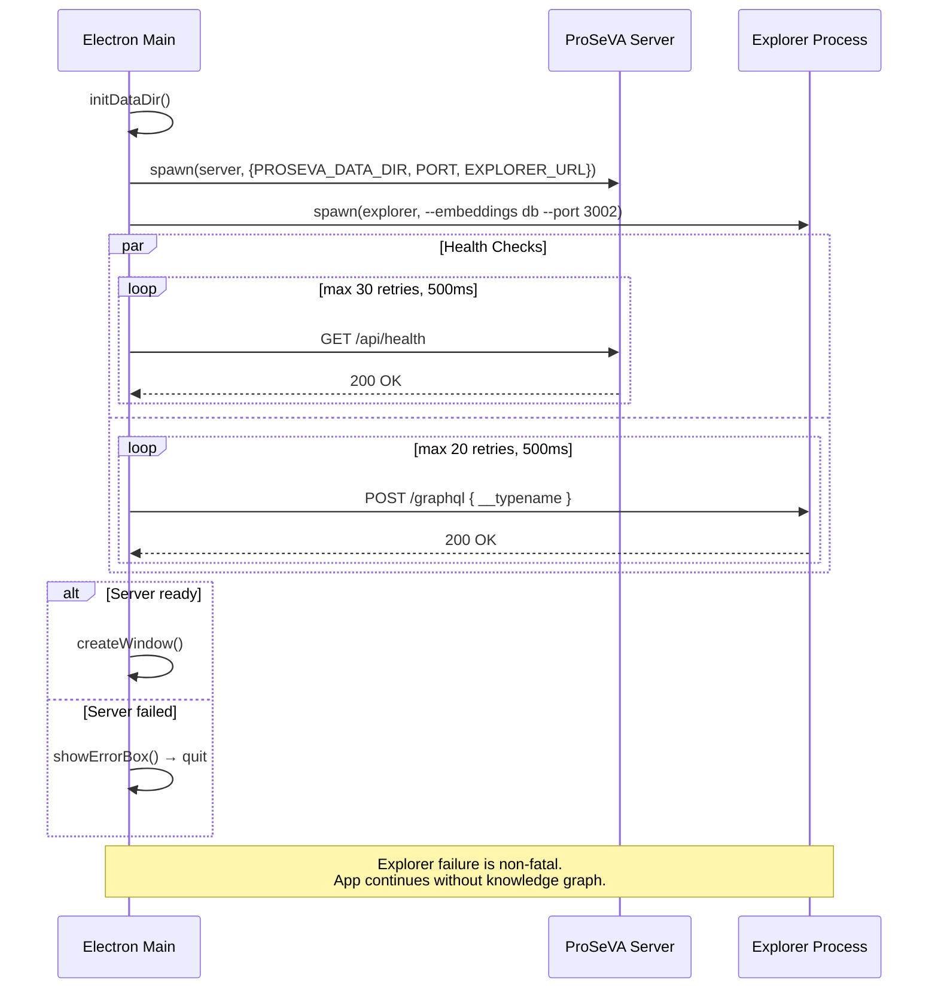

---

## 2. Chat Endpoint — Two-Phase Flow

The chat endpoint uses a two-phase architecture to separate tool execution from conversational response generation. Phase 1 uses `TEXT_MODEL_SMALL` (cheap, fast, good at structured tool use) to run the tool-calling loop. Phase 2 uses `TEXT_MODEL_LARGE` (better natural language) with a clean context — no tool schemas — to produce the final user-facing reply.

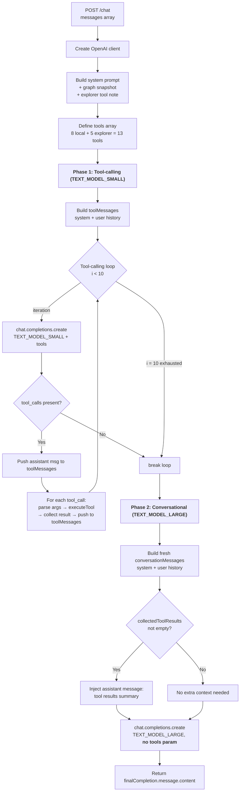

---

## 3. Research Agent — Two-Phase Flow

Like the chat endpoint, the research agent uses a two-phase architecture. Phase 1 uses `TEXT_MODEL_SMALL` for tool-calling, accumulating `toolResults` for the sidebar. Phase 2 uses `TEXT_MODEL_LARGE` with a clean context to produce the final research memo.

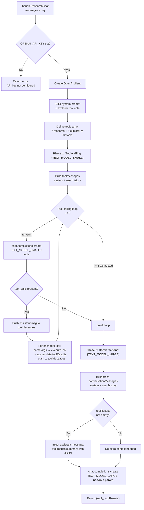

---

## 4. Tool Dispatch — Routing Decision

Both the chat handler and research agent use the same pattern to route tool calls. Local tools are handled by a switch statement; explorer tools fall through to a type-guard check.

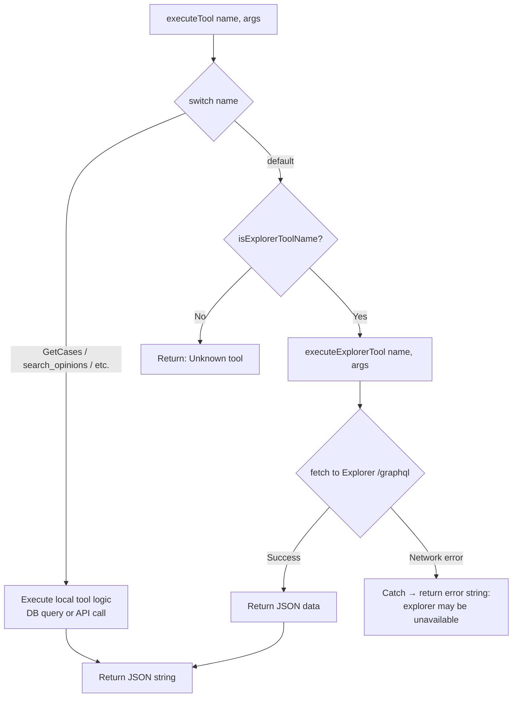

---

## 5. Explorer Tool Executor — Internal Flow

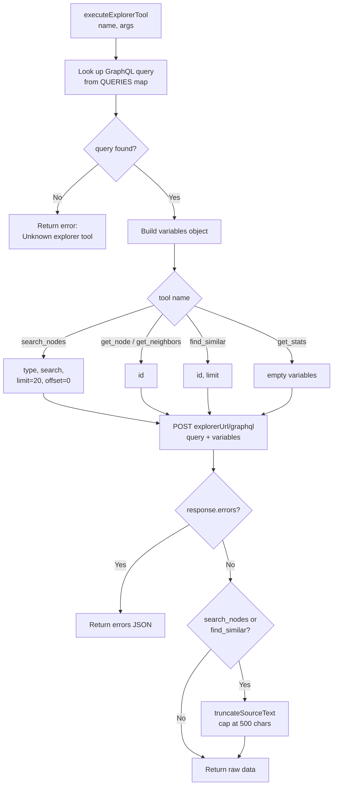

---

## Scenario A: Chat — "What does Virginia Code say about FOIA?"

The user asks about Virginia's Freedom of Information Act. Phase 1 (`TEXT_MODEL_SMALL`) uses both the local `SearchKnowledge` vector search and the explorer's graph tools to gather context. Phase 2 (`TEXT_MODEL_LARGE`) receives the collected tool results and synthesizes a natural language answer with no tool schemas polluting the context.

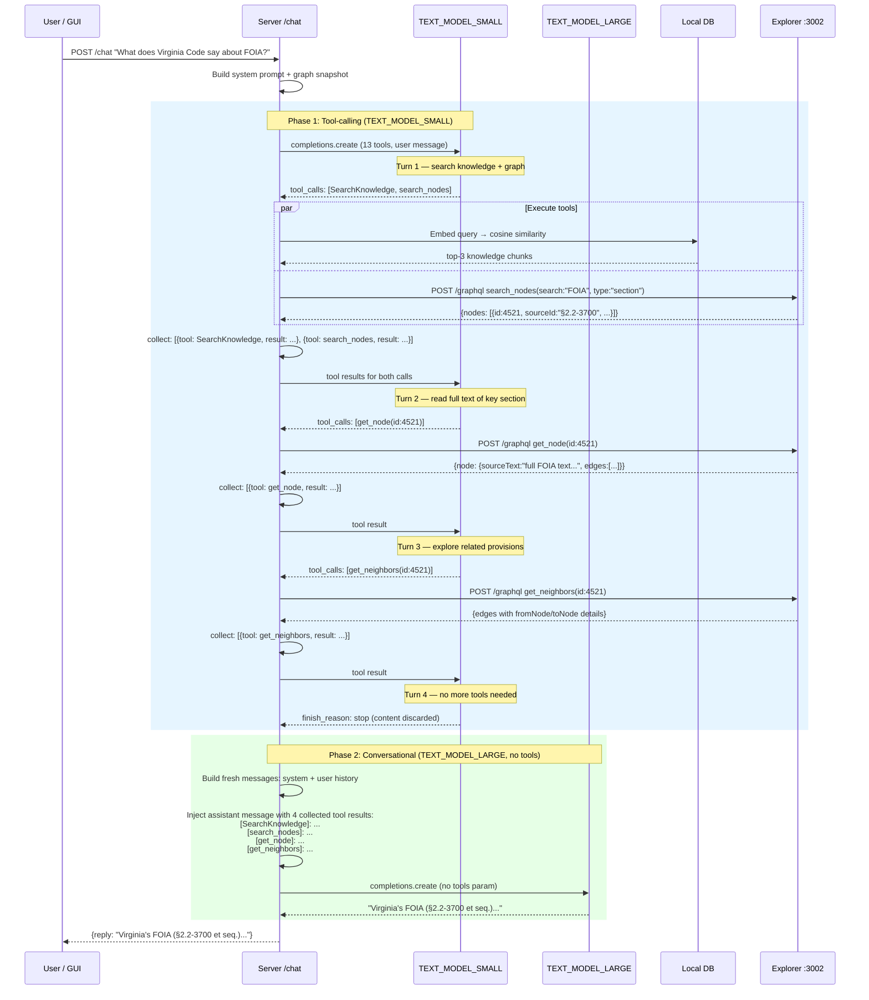

### Tool Call Breakdown

```mermaid
flowchart LR
    subgraph "Phase 1 — TEXT_MODEL_SMALL"
        subgraph Turn 1
            A1[SearchKnowledge<br/>query: FOIA] --> A2[Vector cosine search<br/>over embeddings DB]
            B1[search_nodes<br/>search: FOIA<br/>type: section] --> B2[GraphQL → Explorer<br/>returns truncated nodes]
        end

        subgraph Turn 2
            C1[get_node<br/>id: 4521] --> C2[GraphQL → Explorer<br/>returns full sourceText<br/>+ edge list]
        end

        subgraph Turn 3
            D1[get_neighbors<br/>id: 4521] --> D2[GraphQL → Explorer<br/>returns connected nodes<br/>cites/contains/amends]
        end

        subgraph Turn 4
            E1[No tool calls] --> E2[Phase 1 loop breaks]
        end

        Turn 1 --> Turn 2 --> Turn 3 --> Turn 4
    end

    subgraph "Phase 2 — TEXT_MODEL_LARGE"
        F1[System + history<br/>+ tool results summary] --> F2[Final answer returned<br/>clean context, no tool schemas]
    end

    Turn 4 --> F1
```

---

## Scenario B: Research — "Research Virginia court jurisdiction rules"

The research agent combines external legal API searches with the local knowledge graph. Phase 1 (`TEXT_MODEL_SMALL`) gathers data from external APIs and the explorer, accumulating `toolResults` for the sidebar. Phase 2 (`TEXT_MODEL_LARGE`) receives the collected results and writes a comprehensive research memo with no tool schemas in context.

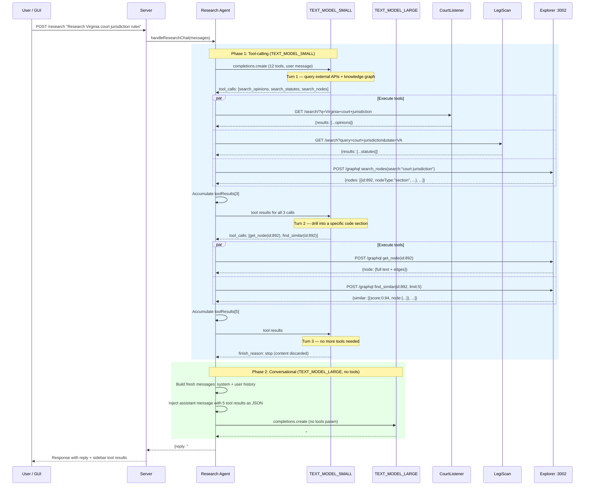

### toolResults Accumulation

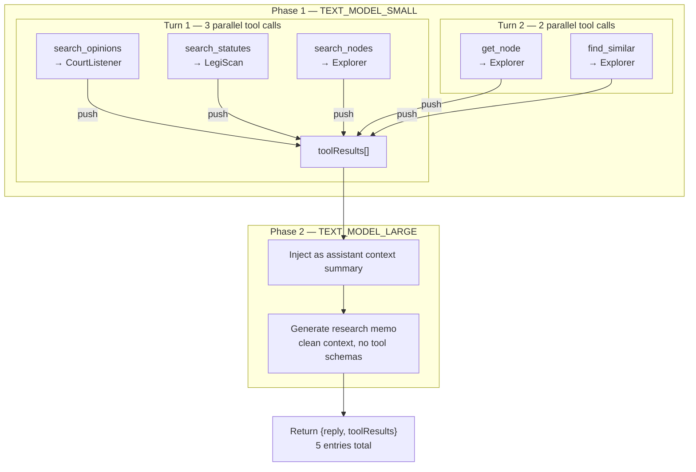

---

## Scenario C: Graceful Degradation — Explorer Unavailable

When the explorer process is down, explorer tool calls fail gracefully. Phase 1's `TEXT_MODEL_SMALL` receives the error and adapts by falling back to local tools. Phase 2's `TEXT_MODEL_LARGE` receives the collected results (including the error) and produces the final answer.

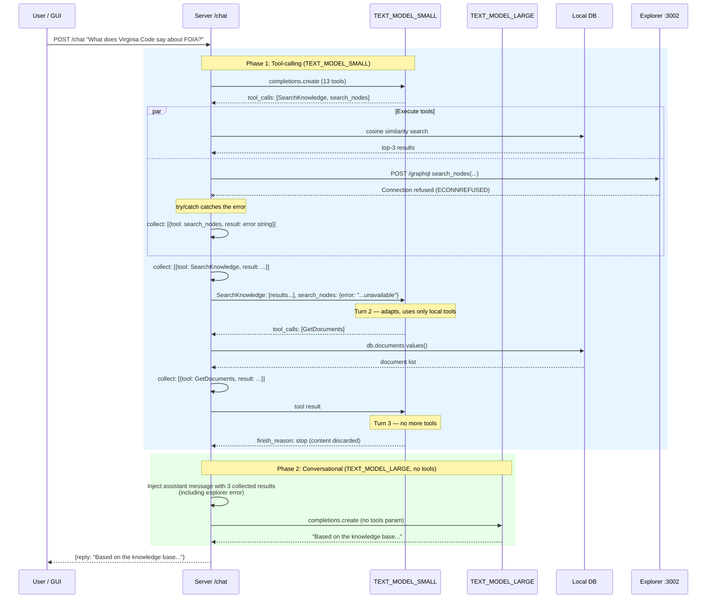

### Error Propagation Path

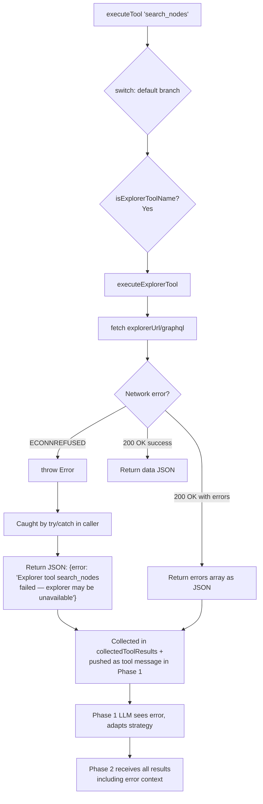

---

## Scenario D: Research — Full Iteration Exhaustion

If the Phase 1 LLM keeps calling tools without stopping, the loop terminates after the maximum number of iterations. Phase 2 still runs, receiving all accumulated tool results, and produces a coherent response from `TEXT_MODEL_LARGE`.

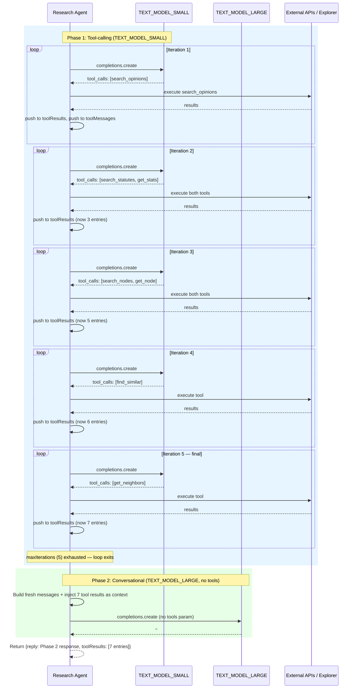

---

## Architecture Overview

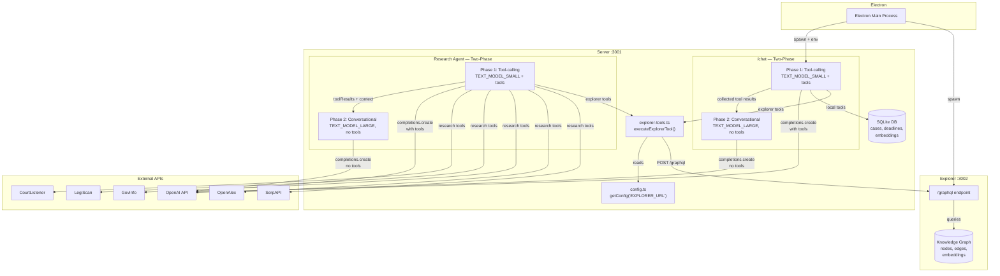
