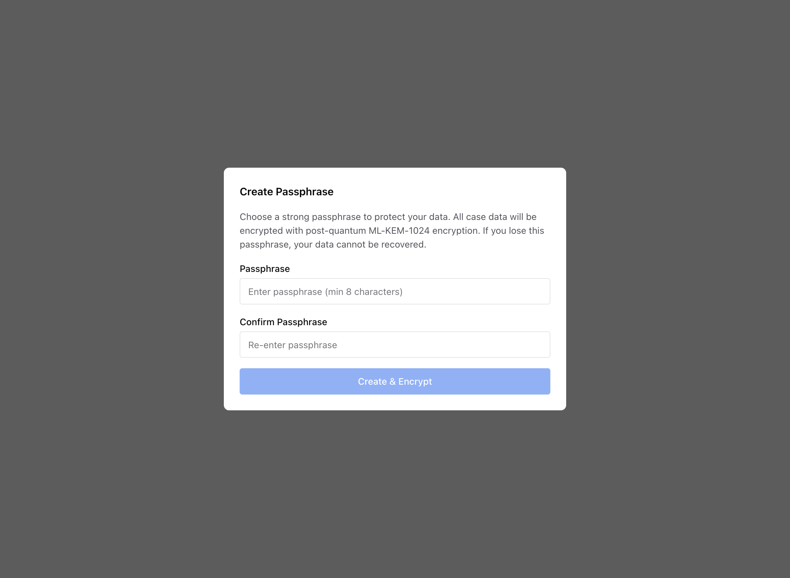
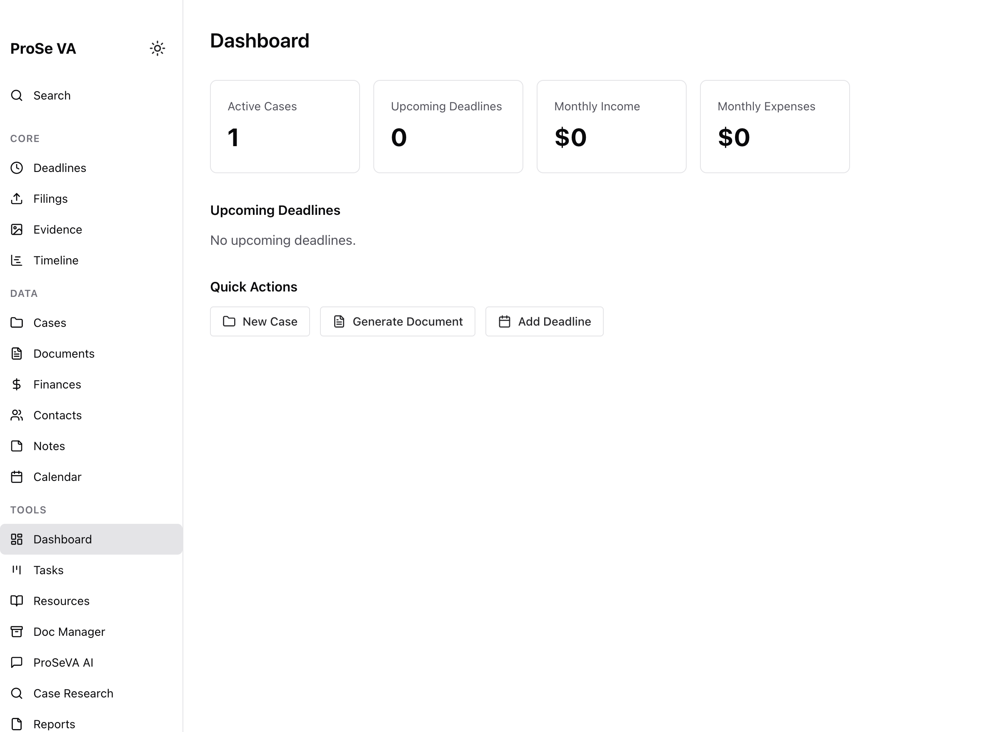
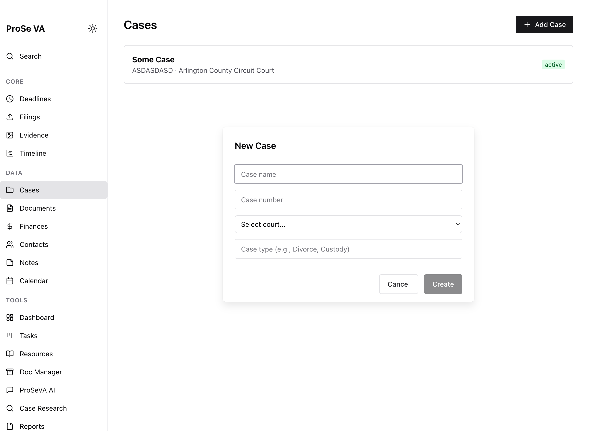
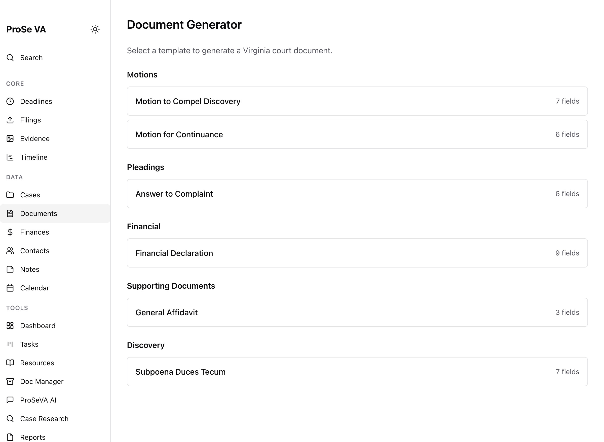
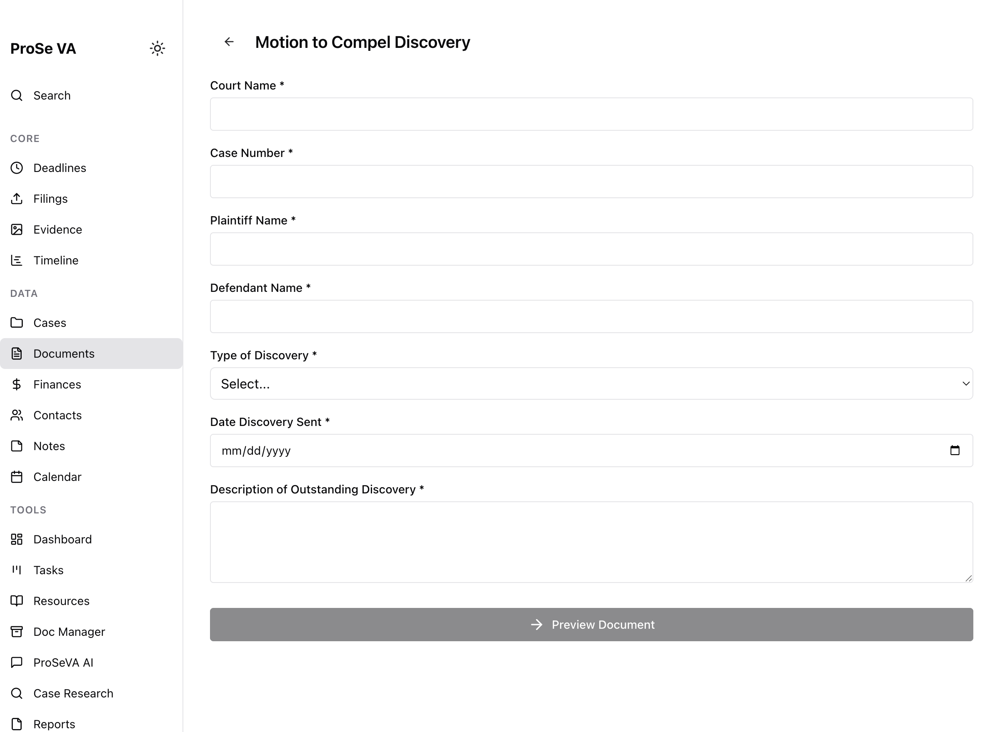
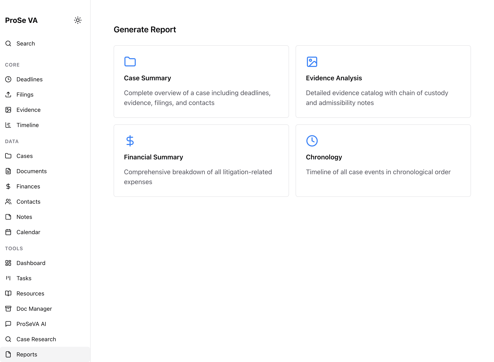

# Pro Se VA User Manual

## 1. First Launch and Security Setup

On first launch, create a passphrase to encrypt your local data.

## 2. Dashboard Overview

After sign-in, the dashboard shows your case summary, upcoming activity, and quick access panels.

## 3. Case Management

Open **Cases** from the main navigation to view and manage your case records.

Use **Add Case** to create a new case entry.

## 4. Deadlines

Open **Deadlines** to track court and filing deadlines.

Use **Add Deadline** to create a deadline, assign it to a case, and set key dates.

## 5. Document Generator

Open **Documents** to generate legal forms and filings from templates.

Select a template and complete the required fields before generating output.

## 6. Reports

Open **Reports** to produce case summaries, timelines, and analysis reports.

## 7. Settings

Open **Settings** to configure your profile, preferences, and app options.

## Notes

- The passphrase setup screenshot (`01-create-passphrase.png`) was captured from a normal startup flow.
- The remaining screenshots were captured from a test-mode app session on port `5173` to allow navigation through all pages.
