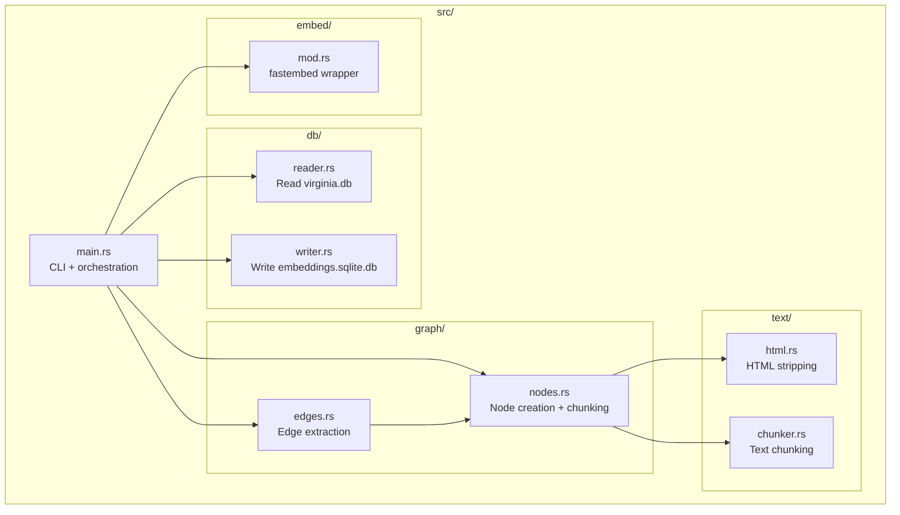
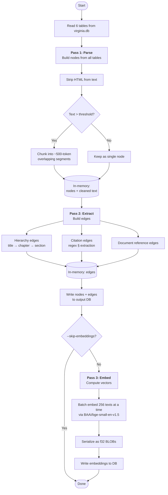
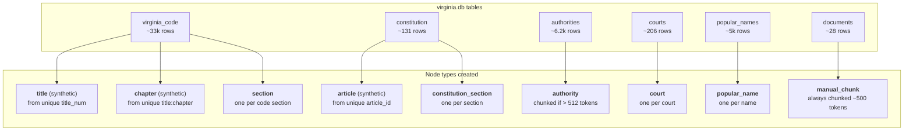
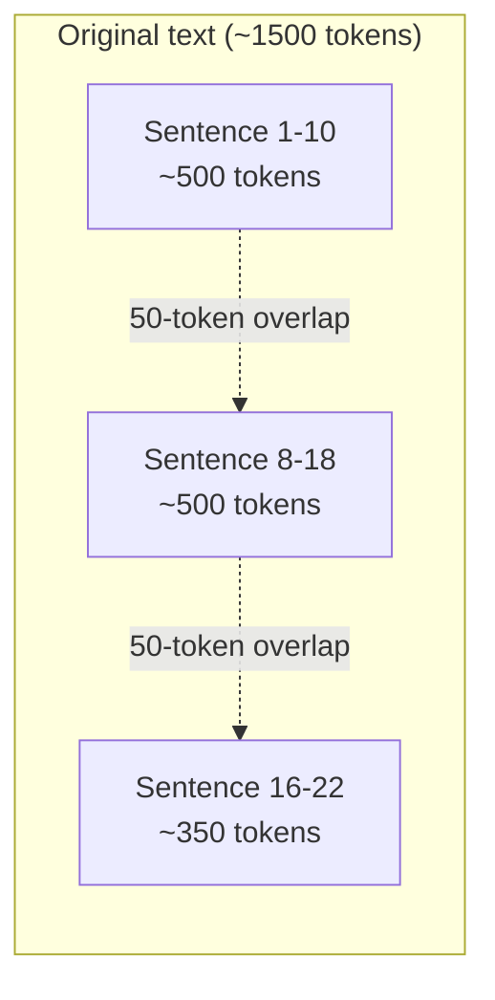
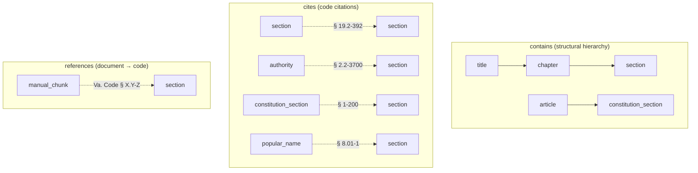
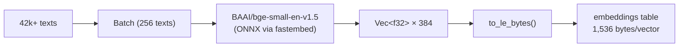
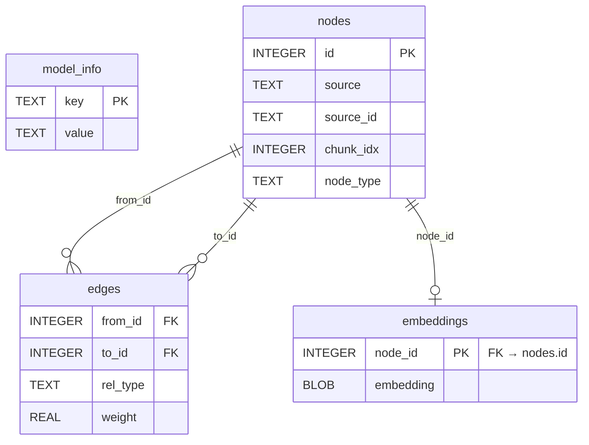

# proseva-embeddings

Rust CLI tool that builds a knowledge graph and precomputed vector embeddings from `virginia.db`. This is a one-shot build tool — run it once when the dataset changes, ship the output `embeddings.sqlite.db` alongside `virginia.db`.

## Overview


The tool reads six tables from `virginia.db`, constructs a knowledge graph of nodes and edges, computes vector embeddings for semantic search, and writes everything to `embeddings.sqlite.db`.

---

## Architecture



---

## Usage

```bash
cargo run --release -- \
  --input ../datasets/data/virginia.db \
  --output ../datasets/data/embeddings.sqlite.db
```

### Flags

| Flag | Default | Description |
|------|---------|-------------|
| `--input` | (required) | Path to `virginia.db` |
| `--output` | sibling of input | Path to write `embeddings.sqlite.db` |
| `--model` | `BAAI/bge-small-en-v1.5` | fastembed model name |
| `--batch-size` | `256` | Texts per embedding batch |
| `--skip-embeddings` | `false` | Only build graph, skip Pass 3 |

---

## The Three Passes



---

### Pass 1: Parse — Build Nodes

Reads every table in `virginia.db` and creates a **node** for each embeddable unit of content.



**Synthetic nodes** (title, chapter, article) represent structural groupings. They participate in hierarchy edges but do not get embeddings — they have no standalone text content worth embedding.

#### Text Preparation

Each node type prepares its embeddable text differently:

| Node type | Text formula |
|-----------|-------------|
| `section` | `strip_html(title) + " " + strip_html(body)` |
| `constitution_section` | `strip_html(section_name) + " " + strip_html(section_title) + " " + strip_html(section_text)` |
| `authority` | `strip_html(title) + " " + strip_html(body)` |
| `court` | `name + locality + court_type + district + city` |
| `popular_name` | `strip_html(name) + " " + strip_html(body)` |
| `manual_chunk` | `strip_html(title) + " " + strip_html(content)` |

#### HTML Stripping

Uses the `scraper` crate to parse HTML fragments, extract text content, and normalize whitespace. If the input contains no `<` characters, it skips parsing and just normalizes whitespace (fast path).

#### Chunking

Large texts are split into overlapping segments to keep each embedding focused:



- **Max chunk size**: ~500 tokens (word-approximated)
- **Overlap**: ~50 tokens between consecutive chunks
- Splits on **sentence boundaries** (`.`, `?`, `!`) to maintain coherence
- If a single sentence exceeds 500 tokens, it becomes its own chunk
- Authorities: only chunked if total text > 512 tokens
- Documents: always chunked

---

### Pass 2: Extract — Build Edges

Builds three types of relationships between nodes.



#### Hierarchy Edges (`contains`)

Built from the grouping structure in `virginia_code` and `constitution`:

- **title** → **chapter**: from matching `title_num` fields
- **chapter** → **section**: from matching `title_num:chapter_num` to section rows
- **article** → **constitution_section**: from matching `article_id`

#### Citation Edges (`cites`)

Extracted via regex from the cleaned text of sections, constitution sections, authorities, and popular names.

Three regex patterns are applied:

| Pattern | What it matches | Example |
|---------|----------------|---------|
| `href.*?/vacode/([^/'"]+)` | VA Code URLs in `<a>` tags | `href="/vacode/19.2-392"` |
| `§\s*(\d+(?:\.\d+)*-\d+(?:\.\d+)*)` | Single section references | `§ 2.2-3700` |
| `§§\s*([\d.,\s\-and]+)` | Plural section lists | `§§ 1-200, 2-300, and 3-400` |

Each extracted section number is resolved against the node lookup map. Unresolvable references (no matching node) are dropped silently. Self-citations are excluded.

#### Document Reference Edges (`references`)

Same regex patterns applied to raw document content (before HTML stripping, to capture `href` attributes). Only the **first chunk** of each document creates reference edges, to avoid duplicate edges from overlapping chunks.

#### Deduplication

All edges are sorted by `(from_id, to_id, rel_type)` and deduplicated. The output DB uses `INSERT OR IGNORE` with a composite primary key as a secondary guard.

---

### Pass 3: Embed — Compute Vectors



- **Model**: `BAAI/bge-small-en-v1.5` — 384 dimensions, ~130MB ONNX model downloaded on first run
- **Batch size**: 256 texts per batch (configurable via `--batch-size`)
- **Skips**: synthetic hierarchy nodes (no text to embed) and nodes with empty text
- **Storage**: raw little-endian `f32` bytes — 384 floats * 4 bytes = **1,536 bytes** per vector
- **Progress**: `indicatif` progress bar with ETA

Supported models (via `--model`):
- `BAAI/bge-small-en-v1.5` (default, 384 dims)
- `BAAI/bge-base-en-v1.5`
- `BAAI/bge-large-en-v1.5`

---

## Output Schema



### Tables

**`model_info`** — metadata about the embedding model used.

| key | value (example) |
|-----|-----------------|
| `model_name` | `BAAI/bge-small-en-v1.5` |
| `dimensions` | `384` |

**`nodes`** — one row per embeddable or structural unit.

| Column | Description |
|--------|-------------|
| `id` | Auto-incrementing primary key |
| `source` | Source table in virginia.db (`virginia_code`, `constitution`, etc.) |
| `source_id` | Identifier within that table (section number, short_name, filename, etc.) |
| `chunk_idx` | 0 for single nodes, 0..N for chunked content |
| `node_type` | `section`, `title`, `chapter`, `article`, `constitution_section`, `authority`, `court`, `popular_name`, `manual_chunk` |

**`edges`** — directed relationships between nodes.

| Column | Description |
|--------|-------------|
| `from_id` | Source node |
| `to_id` | Target node |
| `rel_type` | `contains`, `cites`, or `references` |
| `weight` | Reserved for future use (currently NULL) |

**`embeddings`** — one row per non-synthetic node.

| Column | Description |
|--------|-------------|
| `node_id` | FK to nodes.id |
| `embedding` | 1,536-byte BLOB (384 little-endian f32 values) |

### Indexes

- `idx_nodes_source` on `(source, source_id)` — lookup nodes by origin
- `idx_edges_to` on `(to_id, rel_type)` — find incoming edges
- `idx_edges_type` on `(rel_type)` — filter by relationship type

---

## Typical Output Stats

From a full run against the production `virginia.db`:

```
Nodes:  44,402 total (42,751 embeddable, 1,651 synthetic)
Edges:  80,554 total
  - contains:    34,717
  - cites:       43,547
  - references:   2,290
```

| Node type | Count |
|-----------|-------|
| `section` | 33,702 |
| `popular_name` | 5,093 |
| `manual_chunk` | 2,062 |
| `chapter` | 1,561 |
| `authority` | 1,557 |
| `court` | 206 |
| `constitution_section` | 131 |
| `title` | 76 |
| `article` | 14 |

---

## Verification

```bash
# Build graph only (fast, ~1.5s)
cargo run --release -- \
  --input ../datasets/data/virginia.db \
  --output /tmp/test.db \
  --skip-embeddings

# Spot-checks
sqlite3 /tmp/test.db "SELECT count(*) FROM nodes"
sqlite3 /tmp/test.db "SELECT rel_type, count(*) FROM edges GROUP BY rel_type"
sqlite3 /tmp/test.db "SELECT node_type, count(*) FROM nodes GROUP BY node_type ORDER BY count(*) DESC"

# Full run with embeddings
cargo run --release -- \
  --input ../datasets/data/virginia.db \
  --output ../datasets/data/embeddings.sqlite.db

# Verify embeddings
sqlite3 ../datasets/data/embeddings.sqlite.db "SELECT count(*) FROM embeddings"
sqlite3 ../datasets/data/embeddings.sqlite.db "SELECT length(embedding) FROM embeddings LIMIT 1"
# → should return 1536 (384 * 4)
```

---

## Dependencies

| Crate | Version | Purpose |
|-------|---------|---------|
| `rusqlite` | 0.31 (bundled) | SQLite read/write |
| `fastembed` | 4 | ONNX-based text embeddings |
| `clap` | 4 (derive) | CLI argument parsing |
| `scraper` | 0.20 | HTML parsing and text extraction |
| `regex` | 1 | Citation pattern matching |
| `indicatif` | 0.17 | Progress bars |
| `anyhow` | 1 | Error handling |
| `rayon` | 1 | Parallel iteration (available for future use) |
